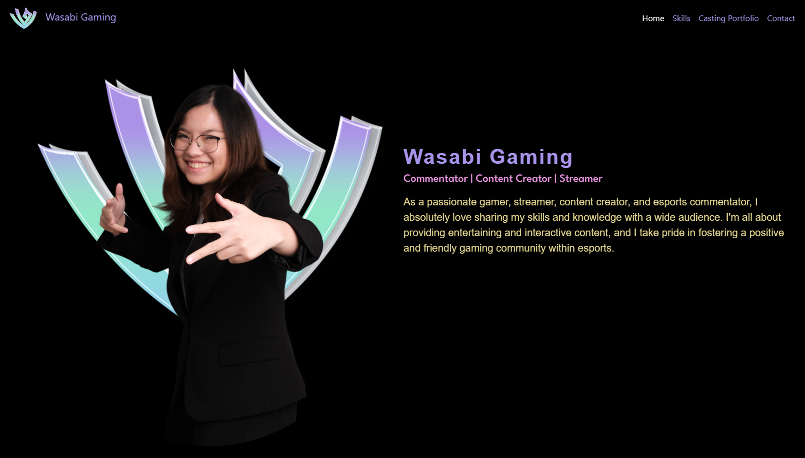

### Project Overview
This portfolio features detailed sections on various esports events, achievements, and contributions to the esports community. From commentating and hosting local tournaments to international level competitions. This portfolio captures the essence of my esports career under the name Wasabi Gaming.

### Website Features
- Responsive design that looks great on both desktop and mobile devices.
- Dynamic content sections showcasing different aspects of my esports career.
- Interactive timeline featuring various career highlights and events.

### View The Website
You can view my esports portfolio by visiting my website <a href="https://wasabigaming03.com/" target="_blank" style="color: #e9da93; text-decoration: none;">here</a>

### Source Code
The source code for this project is available on GitHub. Check it out <a href="https://github.com/ijf03/WG" target="_blank" style="color: #e9da93; text-decoration: none;">here</a>.

<!-- ### Gallery

 -->

